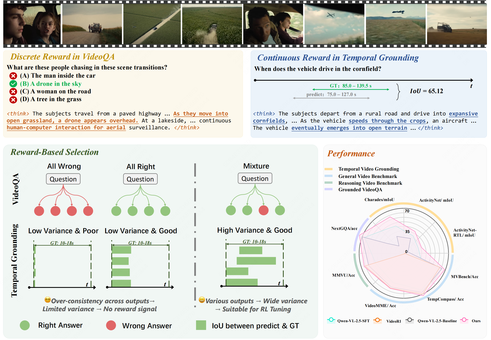

# Temporal-R1: Envolving Temporal Reasoning Capability into LMMs via Temporal Consistent Reward

<div align="center">

</div>

## Project Introduction
Thanks to the powerful performance of reasoning capabilities of DeepSeek-R1, reinforcement learning-based fine-tuning paradigms have garnered widespread attention from researchers. Some studies have explored the preliminary performance of GRPO in multimodal tasks, such as object localization, counting, etc. We investigate the potential of GRPO in the video temporal grounding task, which demands precise temporal alignment between visual and linguistic modalities as well as advanced reasoning capabilities. This task is particularly well-suited for our approach due to its reliance on fine-grained temporal dynamics, which facilitate the development of intuitive rule-based reward mechanisms and enable the model to iteratively refine its reasoning and outputs.

## News
[2025/3/20] 🔥 The code and checkpoints has been released! Please check our huggingface repo. [Checkpoints](https://huggingface.co/appletea2333)

## Experimental Setting
* Training-Framework: We utilize the [Easy-R1](https://github.com/hiyouga/EasyR1) framework and contribute to video training.
* Model: We select [Qwen2.5-VL-3B](https://huggingface.co/Qwen/Qwen2.5-VL-3B-Instruct) as base model.
* Dataset: Charades and ActivityNet-tvg.

## Installation Guide
```
git clone https://github.com/appletea233/Temporal-R1.git
cd Temporal-R1
pip install -e .

# eval with lmms-eval
cd third_party/lmms-eval
pip install -e .
```

## Dataset
1. Download the [annotation files and videos](https://huggingface.co/datasets/appletea2333/temporal_r1)

2. You need to create a file named `tvg.yaml` under  `examples/data_config` with the following content:

```
datasets:
    - json_path: xxx.json
      data_folder: xx
    - json_path: yyy.json
      data_folder: yy
```
The json_path is the dataset file, and the data_folder stores the videos.

## Usage Instructions

Train the Model:
```
bash examples/qwen2_5_vl_3b_tvg.sh
```
Run Inference:
```
# Custom Inference
bash third_party/lmms-eval/examples/eval_tvg.sh $GPUS $MODEL_PATH $TASKS

# R1 Inference
bash third_party/lmms-eval/examples/eval_tvg_r1.sh $GPUS $MODEL_PATH $TASKS

# task uses temporal_grounding_charades,temporal_grounding_activitynet
```
## Experimental Results
| Para. | token         | RL  |think | mIoU(Charades)  | mIoU(ANet-tvg, OOD)       | Checkpoint|
|------|------------------|----------|------------|------------|-----------|-----------|
| 3b    | 2048         | ❌     | ❌ | 37.22     | 18.92 | [Qwen/Qwen2.5-VL-3B-Instruct](https://huggingface.co/Qwen/Qwen2.5-VL-3B-Instruct)|
| 3b    | 2048         | SFT    | ❌ | 45.95     | 20.86 |[SFT-3B-Charades](https://huggingface.co/appletea2333/SFT-3B-Charades) |
| 3b    | 2048         | ✅    | ❌ | 51.10     | 22.10 |[Temporal-R1-3B-Charades](https://huggingface.co/appletea2333/Temporal-R1-3B-Charades) |
| 3b    | 2048         | ✅     | ✅ | 53.93 <span style="color: green;">(**+7.98**)</span>    | 23.07 <span style="color: green;">(**+2.21**)</span>| [Temporal-R1-3B-Charades](https://huggingface.co/appletea2333/Temporal-R1-3B-Charades) |

**1. Video Temporal Grounding Results**

Experimental results demonstrate that, compared to the SFT model, the GRPO-trained model not only achieves significant performance improvements but also exhibits reasoning ("think") capabilities and stronger generalization. Specifically, the mIoU on the Charades dataset increased by **+7.98**, while the mIoU on the ActivityNet benchmark also showed a improvement (**+2.21**). These findings indicate that GRPO training enables the model to perform better in complex tasks and adapt more effectively to diverse data distributions. In addition, we also evaluated the model's performance when generating only the final output without including its reasoning process. The experimental results indicate that performance declines across the board, suggesting that the inclusion of a reasoning process has a positive effect on our model. We plan to release more related experimental results in the future.

**2.Training Phenomena**

<div align="center">
 
</div>
From the left figure, it can be observed that the average reward increases progressively during training and eventually converges to a stable value. This indicates that the reward we design is reasonable and effectively guides the model in optimizing the objective and is improving performance. The right figure illustrates the variation in the token length of responses. Initially, the length increases rapidly, followed by a sharp decline, and then fluctuates upward within a certain range. This phenomenon is consistent with the training characteristics of DeepSeek-Zero, reflecting the model’s adaptive adjustment of length during generation. Such dynamic changes may represent the model's natural behavior in balancing output quality and complexity, further validating the effectiveness and rationality of the training strategy.

**3. VideoQA Results**
We explored the performance of our model when directly tested on the VideoQA task using MVBench. Our model achieves an accuracy of 59.6, slightly lower than the base model's 63.35. However, the model fine-tuned through direct supervised fine-tuning on the same training data completely lost its ability to output valid options. This phenomenon highlights that reinforcement learning-based fine-tuning preserves a significantly higher degree of generalization compared to SFT.

## TODO:

- Scale up model, datasets

- Widen more downstream tasks, e.g., VideoQA, Temporal Referring, Video Captioning, etc.

## Acknowledgments
We want to thank [EasyR1](https://github.com/hiyouga/EasyR1), [Qwen2.5-VL](https://github.com/QwenLM/Qwen2.5-VL), [llama-factory](https://github.com/hiyouga/LLaMA-Factory) and [lmms-eval](https://github.com/EvolvingLMMs-Lab/lmms-eval) for publicly releasing their code and pretrained models.

## Citation
Contributors: [Hongyu Li](https://github.com/appletea233), [Songhao Han](https://github.com/hshjerry), [Yue Liao](https://github.com/YueLiao), [Jialin Gao](https://scholar.google.com/citations?user=sj4FqEgAAAAJ&hl=zh-CN), [Si Liu](https://scholar.google.com/citations?user=-QtVtNEAAAAJ&hl=zh-CN)

```bibtex
@misc{li2025temporalr1,
  title        = {Temporal-R1: Envolving Temporal Reasoning Capability into LMMs via Temporal Consistent Reward},
  author       = {Hongyu Li, Songhao Han, Yue Liao, Jialin Gao, Si Liu},
  howpublished = {\url{https://github.com/appletea233/Temporal-R1}},
  year         = {2025}
}
```
